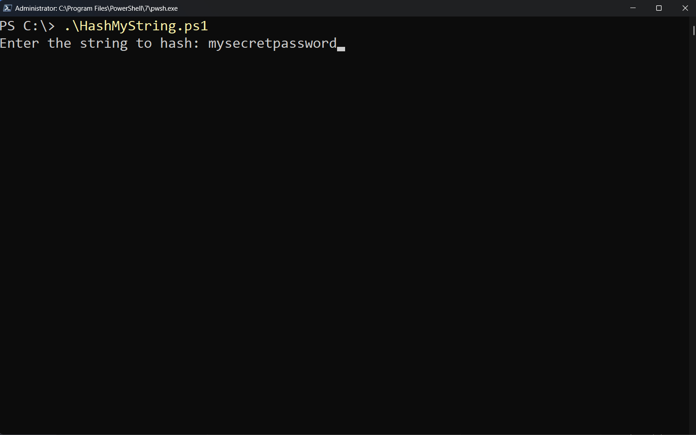
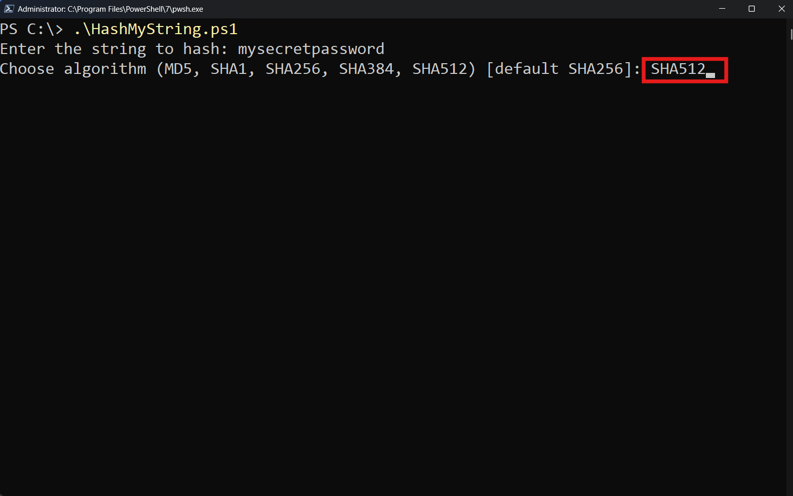
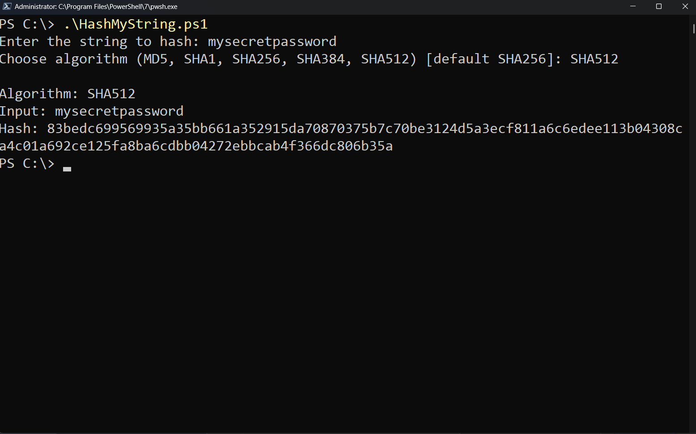
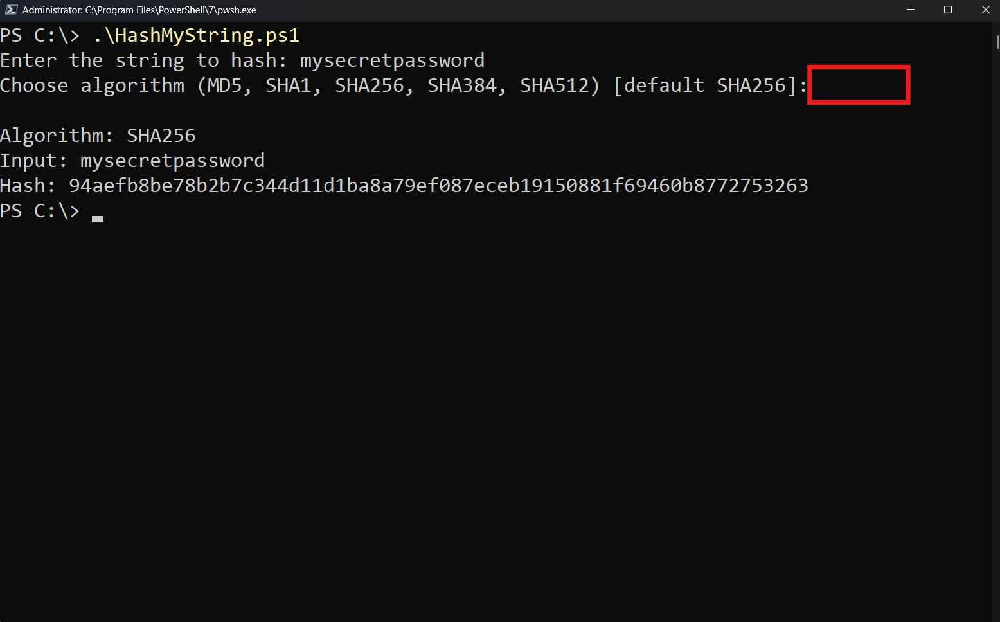
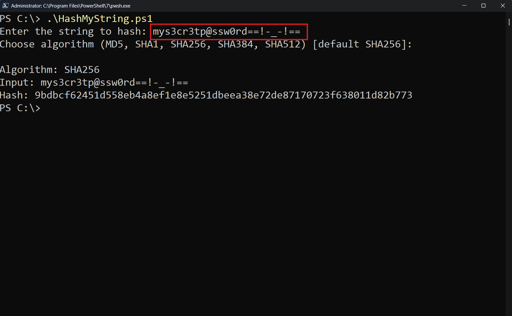

# 🔐 HashMyString

A lightweight PowerShell script that closes a long-standing gap in Windows PowerShell and PowerShell Core, that is: the absence of a built-in **cmdlet that computes a cryptographic hash directly from a string**.  
`HashMyString.ps1` provides a simple, interactive way to hash any text input using modern algorithms such as **MD5, SHA1, SHA256, SHA384, and SHA512**.

---

##  Features
- Interactive input for both **string** and **algorithm**
- Supports the most common hashing algorithms
- Defaults to **SHA256** if no algorithm is selected
- Outputs the hash in **lowercase hexadecimal**
- Uses native .NET cryptography libraries, **no external dependencies**

## Usage

### Run from PowerShell
```powershell
PS C:\> .\HashMyString.ps1
```

### Example session
```text
Enter the string to hash: hello
Choose algorithm (MD5, SHA1, SHA256, SHA384, SHA512) [default SHA256]:
Algorithm: SHA256
Input: hello
Hash: 2cf24dba5fb0a30e26e83b2ac5b9e29e1b161e5c1fa7425e73043362938b9824
```

### How It Works
1. Prompts the user for a string.  
2. Prompts for a hashing algorithm (defaults to SHA256).  
3. Converts the string into UTF-8 bytes.  
4. Uses `[System.Security.Cryptography.HashAlgorithm]::Create()` to compute the hash.  
5. Converts the byte array into a hexadecimal string for display.

## Screenshots

### 1. Entering the String
> The script begins by prompting the user for a string to hash. A short, simple value is entered so the process is easy to follow.  


### 2. Selecting the Algorithm
> After entering the string, the script asks which hashing algorithm to use. In this example, `SHA512` is chosen manually.


### 3. Hash Output – SHA512
> The script now computes the hash using **SHA512**. It confirms the selected algorithm, echoes the original input, and displays the resulting digest in lowercase hexadecimal format.  


### 4. Hash Output – Default SHA256
> This example shows what happens when the user presses Enter without specifying an algorithm. The script defaults to **SHA256** and prints the hash as a continuous lowercase hex string.  


### 5. Hashing Complex Input
> Finally, a demonstration using a string with numbers, symbols, and punctuation. The script handles all ASCII characters correctly and still produces a valid lowercase hex digest.  


## License
This project is licensed under the [MIT License](LICENSE).  
© 2025 Athanasios Oikonomopoulos
